# PRAKTIKUM 13
Pada repository ini, kali ini Saya akan membuat program Web Scraping dengan menggunakan Python. Sebelumnya, Saya akan menjelaskan apa itu Web Scraping. 
Langsung saja, kita masuk ke inti repository ini.<br/>

### Pengertian Web Scraping<br/>
Data Scraping adalah suatu teknik dalam mengumpulkan data dari berbagai sumber data. Pengumpulan data yang dilakukan salah satunya adalah data yang berasal dari website, 
sehingga lebih dikenal dengan Web Scraping. Dengan web scraping kita bisa mendapatkan data yang terstruktur dari sumber yang tidak terstruktur dengan mudah, lalu mendapatkan insight dari
sejumlah data untuk kepentingan bisnis. Peluang pekerjaan bidang web scraping juga sangat dibutuhkan dan terbuka sangat luas. Secara umum ada dua teknik yang dipakai dalam web scraping, teknik Web Scraping adalah sebagai berikut :
- Manual (copy paste )
- Otomatis (dengan software / tools)
### Tools / Alat yang digunakan<br/>
Dalam web scraping ini ada beberapa tools yang harus digunakan, diantaranya adalah:<br/>
- Python&emsp;&emsp;&emsp;&emsp;&nbsp;&ensp; | [klik disini](https://www.python.org/)
- Google Colab&emsp;&nbsp;&ensp; | [klik disini](https://colab.research.google.com/)
- pip Requests&emsp;&nbsp;&ensp;&nbsp; | [klik disini](https://pypi.org/project/requests/)
- pip BeautifulSoup | [klik disini](https://pypi.org/project/beautifulsoup4/)

### Install library pip
- Sebelum meng-install library, tentunya python harus sudah terinstall<br/>
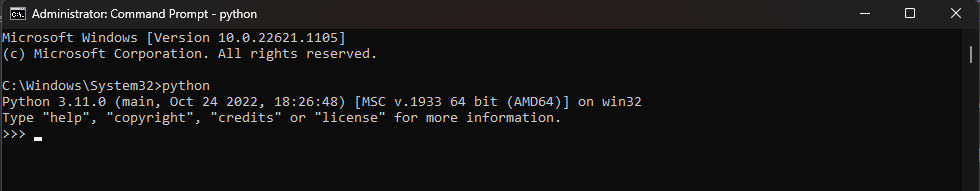
- Jika sudah, kita install library Requests, BeautifulSoap, & Pandas. Cara installnya adalah :<br/>
&nbsp;- Buka CMD, dengan run as administrator<br/>
&nbsp;- Setelah terbuka ketik command berikut :<br/>
&emsp;* pip install requests<br/>
&emsp;* pip install pandas<br/>
&emsp;* pip install beatifulsoup4<br/><br/>
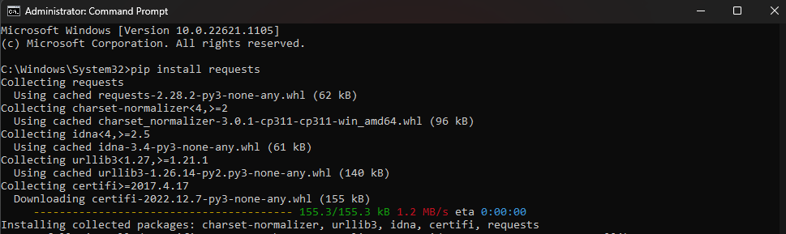
*Requests merupakan library untuk proses mengirim dan mengambil data menggunakan protokol HTTP.*
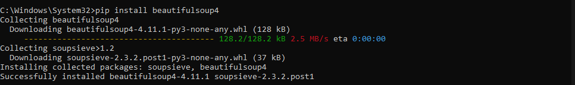
*BeautifulSoup merupakan library yang digunakan untuk proses web scraping halaman HTML dan XML.*
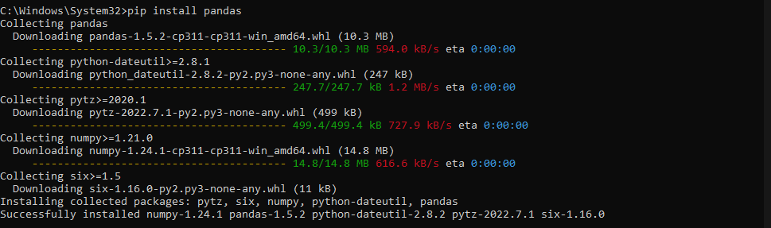
*Pandas adalah library open source pada Python yang sering digunakan untuk memproses data yang meliputi pembersihan data, manipulasi data, hingga melakukan analisis data.*<br/><br/>
- Library pip sudah berhasil di install.
- Untuk memastikannya, kita bisa ketik command **pip list**.<br/>
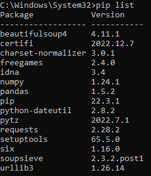

## Pengerjaan
- Buka [google collab](https://colab.research.google.com/) untuk membuat project baru.
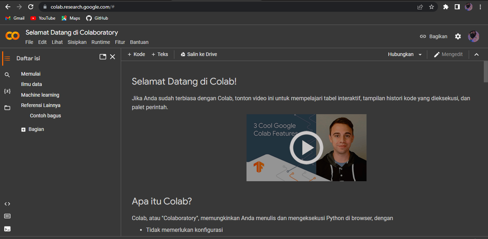
- Jika sudah terbuka, klik tab *File* dan klik *Notebook baru*<br/>
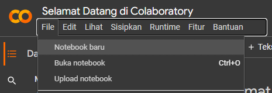
- Maka, kita akan beralih kehalaman baru, silahkan ganti nama file sesuai keinginan<br/>
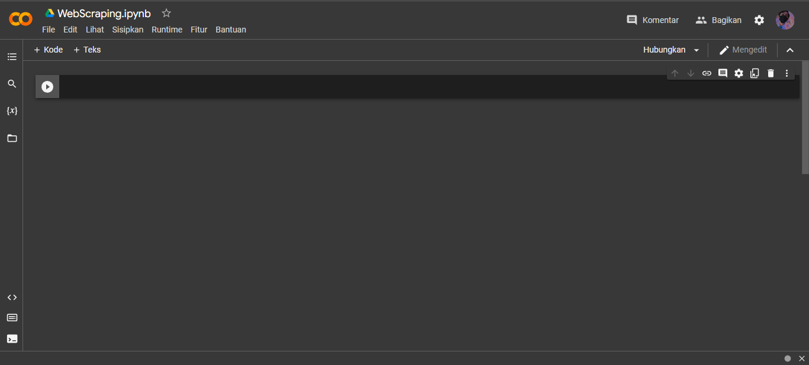
- import library yang sudah di install tadi
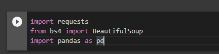
- Disini saya akan melakukan web scraping VGA RTX terlaris pada website toko online, yaitu Bukalapak
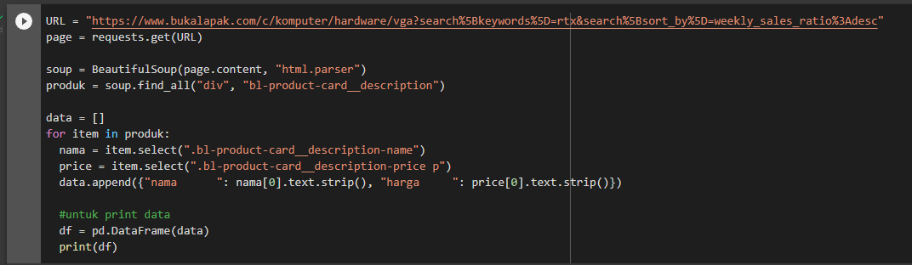
- Maka ketika di RUN, hasilnya akan menunjukan Merek VGA dan juga harganya
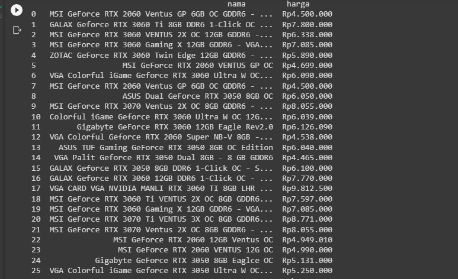

### Kesimpulan
Kesimpulannya Web Scraping sangatlah berguna bagi kita yang ingin mengumpulkan data dari sebuah website. 
Dalam dunia bisnis, web scraping bisa digunakan untuk melakukan berbagai riset, entah itu riset pasar, riset kompetitor, atau riset lainnya.

### Penutup
Sekian dari repository yang sudah Saya buat ini. Mohon maaf jika ada kesalahan kata dalam pengetikkan. Sekian dari Saya, dan terimakasih.

```
Nama 	: Rhendy Diki Nugraha
NIM	    : 312210150
Kelas	: TI.22.A.1
Dosen 	: Agung Nugroho,S.Kom.,M.Kom
```